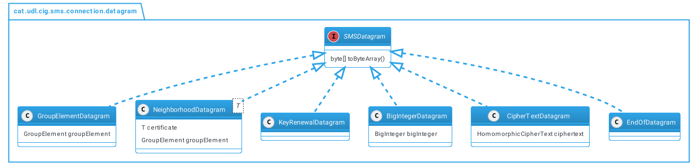

morestring=\[b\]\", morestring=\[s\]\>\<, morecomment=\[s\]\<??>,
stringstyle=, identifierstyle=, keywordstyle=,
morekeywords=xmlns,version,type

# Introducció

Els comptadors intel·ligents són dispositius domèstics que recullen i
envien el consum de l'electricitat a un proveïdor d'energia en intervals
de temps reduïts. El consumidor pot saber el seu consum elèctric en tot
moment i la seva despesa de manera més precisa amb possibles preus i
tarifes personalitzades depenent del consum horari, al permetre la
telelectura.

{width="15cm"}

A causa d'aquest constant enviament d'informació, es poden fer millors
prediccions i tendències de consum de manera que la producció pugui
estar més a prop de l'energia que es necessita, és a dir, la producció
d'energia es pot ajustar més al consum real d'aquesta. A més a més, el
distribuïdor d'energia no té la necessitat de revisar manualment el
consum i la lectura del comptador elèctric en cada llar.\
\
Tot i que és beneficiosa a gran escala, la quantitat d'informació que
proporciona una sola llar es pot utilitzar per fer prediccions de la
vida quotidiana [@smart-grid-overview], com per exemple: quan arriben a
casa, miren la televisió o se'n van al llit. Per tant, és important
mantenir les dades de lectura privades i protegides de qualsevol atac.
Arran d'això, s'han fet diverses propostes, una d'elles ha estat ideada
pel grup de recerca "*Criptografia i Grafs*" de la Universitat de Lleida
[@recsi].\
\
L'objectiu principal d'aquesta memòria ha estat recollir el
desenvolupament de la simulació d'aquesta proposta per tal de resoldre
el problema anteriorment explicat. No obstant això, es necessita un
assoliment dels conceptes que envolten el tema per poder entendre
l'actual solució i la seva implementació.\
\
Així doncs, els objectius del treball han estat:

-   Estudiar la solució proposada.

-   Posar en context el xifratge homomòrfic.

-   Posar en context el criptosistema asimètric ElGamal.

-   Implementar un client que simuli un comptador intel·ligent.

-   Implementar un servidor que simuli una subestació d'una comunitat de
    comptadors.

-   Realitzar un estudi dels costs del protocol.

Abans de submergir-se en detalls de la solució proposada, la d'aquest
document s'endinsa en el món de la criptografia i en aquesta s'explica
el xifratge asimètric i homomòrfic. A més a més, es detalla el
criptosistema en què es basa la nostra proposta, ElGamal. A la ,
s'introdueix una visió general i es plantegen les diferents propostes
per tal de solucionar la privacitat dels usuaris. A més a més, s'explica
de manera formal el protocol i s'estableixen les seves fases. Un cop
s'ha detallat la proposta, es passa a l'explicació de la implementació i
el disseny del programa a la . Finalment, a la s'analitzarà els costs
del programa en funció del nombre de comptadors, l'algoritme per
realitzar el logaritme discret, entre altres.

# Criptografia i teoria de la computació {#part:criptografia}

### Xifratge simètric i asimètric

Un criptosistema està format per dos tipus d'algorismes, un que
transforma el missatge intel·ligible a un altre inintel·ligible i
l'altre, que funciona de manera inversa. D'aquesta manera, és possible
crear una comunicació segura davant de possibles interceptors de la
informació maliciosos.\
Un criptosistema està constituït per tres conjunts finits i dos famílies
de funcions:

-   El conjunt $M = \{m_1, m_2, ..., m_3\}$ que conté els elements els
    quals volem xifrar.

-   El conjunt $C = \{c_1, c_2, ..., c_3\}$ on hi haurà tots aquells
    elements que poden ser un missatge xifrat.

-   El conjunt de claus $K$ sobre les quals xifrarem i desxifrarem els
    missatges.

-   Funcions de xifratge
    $\{E_k \ | \ E_k : M \rightarrow C \}_{k \in K}$

-   Funcions de desxifratge
    $\{D_k \ | \ D_k : C \rightarrow M \}_{k \in K}$

Aquestes funcions satisfan: $$\begin{array}{l}
    \forall \, k_1 \in K, \ \exists \, k_2 \in K\\
    \forall \, m \in M
\end{array} \Bigg\}, \ D_{k_2}(E_{k_1}(m)) = m \Longleftrightarrow D_{k_2} \circ E_{k_1} =  Id$$
Segons la funció de xifratge i desxifratge, els criptosistemes es poden
classificar en dos tipus:

-   En un criptosistema simètric o convencional, la clau és la mateixa
    per xifrar com per desxifrar, és a dir, $k_1 = k_2$. Com que
    l'emissor i el receptor han de compartir la clau, el canal on s'ha
    de transmetre aquesta ha de ser segur perquè no hi hagi
    interceptors. La seguretat d'aquests sistemes es basa en el gran
    cost computacional que es requereix per realitzar l'atac de buscar
    el missatge usant força bruta. Aquest tipus de sistemes es basen en
    fer transformacions al missatge a nivell de bit. A diferència de
    l'encriptació asimètrica, no es poden realitzar signatures digitals,
    ja que no hi ha distinció de claus entre usuaris.

-   El xifratge asimètric ens proporciona, que tothom o un gran conjunt
    d'usuaris puguin xifrar el seu missatge, però només un cert conjunt
    més petit, fins i tot podent ser només un individu, pugui desxifrar
    el missatge. Per tal de realitzar això, per xifrar i desxifrar
    s'utilitzaran dos diferents de claus:

    -   La *clau pública* s'usarà per xifrar el missatge i la podrà
        utilitzar qui vulgui.

    -   La *clau privada* s'usara per desxifrar el missatge i només la
        podrà utilitzar un cert grup d'entitats.

    Aquest tipus de criptosistemes es basen en xifrar mitjançant una
    funció $c = f(m)$ que sigui fàcil d'avaluar però sigui
    computacionalment difícil realitzar $f^{-1}(c)$ sense saber una
    informació addicional que ens permeti trobar el missatge. Aquests
    tipus de funcions es diuen *trap-door function*. Els criptosistemes
    de clau pública, a diferència dels simètrics, no treballen a nivell
    de bit, sinó que representen el missatge com un número i realitzen
    operacions matemàtiques amb ell.

### Problema del logaritme discret

La criptografia que s'utilitzarà en part d'aquest treball es basa en el
problema del logaritme discret. El problema del logaritme discret és un
problema crític en la teoria de nombres i és similar en molts aspectes
al problema de la factorització sencera.\
\
Sigui $G$ un grup cíclic finit amb l'operació de multiplicació i
l'element d'identitat 1 i sigui $g$ un generador del grup $G$. Llavors,
cada element $a \in G$ es pot escriure de la forma:
$$a = g^k, \quad k \in \mathbb{Z^+}.$$ Sabent el valor de $a$ i $g$ és
computacionalment costós[^1] trobar $k$, ja que s'ha de realitzar una
búsqueda de totes les possibles solucions fins trobar: $$k = log_g(a).$$

#### Classificació

Encara no s'ha trobat cap algorisme eficient que resolgui el problema
del logaritme discret en temps polinomial, per això, actualment pertany
al conjunt de problemes *NP*. No obstant això, no és considerat
*NP-Complet* ja que no s'ha trobat una forma de reduir aquest problema a
un que ja sigui *NP-Complet* en temps polinomial.

#### Algorisme Pollard's Lambda {#sec:pollards}

J. M. Pollard [@pollard] va descriure dos algoritmes per resoldre el
problema del logaritme discret: el mètode *Rho* i el mètode *Lambda* o
també anomenat *Kangaroo* [@kangaroo]. El mètode *Lambda* relaxa una
mica el problema, ja que, donat el grup cíclic $G$, es pretén resoldre
el logaritme donat un interval definit entre uns llindars:
$$g^k = a, \quad L \le k \le U.$$ Per tal de resoldre-ho, es creen dues
seqüències que, al trobar-se en un punt vol dir que s'ha trobat la
potència que s'està buscant. El perquè del nom d'aquest mètode esdevé
d'una metàfora, que rau en dos cangurs (les seqüències), un mans i
l'altre salvatge. Aquests se situen en un punt que sabem i en un que no,
que serà el que voldrem saber, respectivament. Quan vagin saltant i es
trobin, sabent el comportament del salvatge podrem veure a quin punt
estava situat al principi.

1.  S'escolleix una funció $f$ pseudoaleatòria que mapejarà els elements
    del grup a un conjunt petit d'enters positius $S$ denominats els
    salts: $$f : G \rightarrow S, \qquad S = \{s_1, \dots, s_n\}$$

2.  Tenint $b = U - 1$, es computa la primera seqüència tal que:
    $$x_0 = g^b, \qquad x_{i+1} = x_i \cdot g^{f(x_i)}, \quad \ i \in \{1, 2, \dots\}$$
    En aquesta seqüència, sabem a quin valor estem realitzant la
    potència sobre $g$, és a dir, seria el cangur mans.

3.  Es computa el sumatori dels elements en els salts aleatoris i
    s'observa que:
    $$d = \sum_{i=0}^{N - 1} f(x_i) ,  \qquad \qquad x_N = x_0 \cdot g^d = g^{b + d}$$

4.  La segona seqüència, que correspondrà al cangur salvatge, vindrà
    donada per:
    $$y_0 = a, \qquad y_{i+1} = y_i \cdot g^{f(y_i)}, \qquad i \in \{1, 2, \dots\}$$
    i estarà acompanyada per la seqüència d'enters
    $\{d_0, d_1, \dots \}$: $$d_n = \sum_{i=0}^{n}f(y_i)$$ El valor
    $d_i$ es pot entendre com la distància que viatja el nostre
    algoritme del cangur salvatge en $i$ passos. A més a més, es pot
    observar que
    $y_i = y_0 \cdot g^{d_i} = a \cdot g^{d_i} = g^{k} \cdot g^{d_i}$.

5.  La computació pararà en el moment que:

    1.  Quan $y_j = x_N$ per alguna $j$. Llavors podem observar que:
        $$x_N = y_j \Longrightarrow g^{b + d} = g^{k + d_j} \Longrightarrow g^k = g^{b + d - d_j} \Longrightarrow k = b + d - d_j$$

    2.  Quan $d_i > b - a + d$, és a dir, s'ha sobrepassat la distància
        a realitzar $d_i > g^b - g^k + d$. En aquest cas, l'algoritme ha
        fallat en trobar $k$, de manera que s'ha de tornar a començar
        canviant el conjunt $S$ i/o la funció $f$.

[@kangaroo] és un algoritme bastant eficient quan la solució es sap que
està en un interval petit, com és en el nostre cas. La seva complexitat
en el temps és $\mathcal{O}(\sqrt{L - U})$. Mesurant la mida del conjunt
en bits, aquest té de mida $log(L - U)$, per aquest motiu
$\mathcal{O}(\sqrt{L - U}) =  \mathcal{O}(2^{log(L - U) / 2})$, és a
dir, és un algoritme exponencial en el temps.

#### Intercanvi de claus Diffie-Hellman {#sec:diffie-hellman}

Diffie-Hellman [@diffie-hellman] és un mètode d'intercanvi de claus
criptogràfiques de manera segura usant un canal obert que es basa en el
problema del logaritme discret. Tradicionalment, la comunicació xifrada
requeria l'intercanvi de claus per un medi físic segur. En comptes
d'això, Whitfield Diffie and Martin Hellman van dissenyar un sistema que
permetia que les dues parts no tinguessin coneixements previs un de
l'altre a l'hora d'establir una clau secreta entre les dues entitats.\
\
Posem d'exemple dues persones (Alice i Bob) que es volen comunicar de
manera secreta i es volen posar d'acord sobre un nombre com a clau per
tal de xifrar la conversa. Sigui $G$ un grup multiplicatiu d'ordre $q$ i
sent $g$ un generador de $G$, $\quad G = \langle g \rangle$, ells dos
tindran la seva contribució secreta $a$ i $b$ a la clau compartida $K$.
Cada un dels participants calcularà $S_i = g^{s_i}$. D'aquesta manera,
Alice i Bob computaran $A = g^a$ i $B = g^b$ respectivament. La clau
pública, per tal de xifrar els missatges a la seva conversa, serà
$K = g^{ab} = A^b = B^a$. L'exemple actual està realitzat entre només
dues entitats, però per regla general:

1.  Cada participant $i \in P \ | \ P = \{1, 2, \dots, n\}$, éssent $n$
    el nombre de participants, té al seva clau secreta $s_i \in G$.

2.  Cada participant $i$ calcularà i enviarà la seva clau pública
    $S_i = g^{s_i}$ al participant $(i+1)$.

3.  Cada participant $(i + 1)$ calcularà $(S_{i})^{s_{i + 1}}$ i enviarà
    el resultat al participant posterior $(i + 2)$. Aquest procediment
    es realitzarà $n -1$ vegades, és a dir, fins arribar al participant
    anterior $(i -1)$ al propietari de la clau $S_i$.

4.  D'aquesta manera, la clau pública del sistema serà el resultat de
    posar $g$ a la potència de totes les claus privades:
    $$K = g^{\prod_{i}^{n} s_i}$$

L'establiment de claus també es possible fer-lo realitzant la
multiplicació entre la clau pública de cada participant $S_i = g^{s_i}$
i la clau parcial compartida que esdevindrà la clau pública del sistema
en la última iteració. Llavors, posant com a exemple el participant $1$
en la primera ronda, calcula:
$$S_i \cdot g^{s_{i + 1}} = g^{s_i} \cdot g^{s_{i+1}} = g^{s_i + s_{i+1}}$$
De manera que, realitzant el càlcul en la última iteració del protocol,
podem veure que la clau compartida o pública del sistema esdevé:
$$K = g^{\sum_{i}^{n} s_i}$$

#### ElGamal

Una altra aplicació basada en el problema de solucionar el logaritme
discret en un grup és el criptosistema asimètric ElGamal [@elgamal].
ElGamal proporciona certa aleatorietat que dificultarà possibles atacs
de força bruta centrats en generar totes les possibles encriptacions. No
obstant això, té l'inconvenient que la llargada del text xifrat serà el
doble de llarg que el missatge en clar. La seva configuració és donada
per:

-   Un grup abelià $G(+, \cdot)$ d'ordre $n$ que tingui un cardinal
    primer gran.

-   L'element generador $g \in G$.

-   La clau privada $d \in [1, n-1]$ que també serà la informació
    trampa.

-   La clau pública $h \in G \ | \ h = g^d$.

##### Xifratge

El xifratge estarà en funció de la clau pública $h \in G$ i el missatge
$m$ i retornarà una tupla $c \in G \times G$.
$$E_h : G \rightarrow G \times G$$

1.  S'escull un enter aleatori dins del rang $r \in [1, n-1]$.

2.  Es computa $c_1 \in G \quad tq. \quad c_1 = g^r$.

3.  Es computa $c_2 \in G \quad tq. \quad c_2 = m \cdot h^r$.

4.  El missatge xifrat serà la parella de valors $c = (c_1, c_2)$.

El primer component del text xifrat $c_1$ es diu *pista*, ja que conté
el valor aleatori $k$, que no és conegut pel destinatari. Per desxifrar,
s'utilitzarà la pista per a l'extracció de text que es troba en el segon
component.

##### Desxifratge

El desxifratge necessitarà la clau privada $d \in \mathbb{Z^+}$ i el
text xifrat $c = (c_1, c_2)$ i retornarà el missatge.
$$D_h : G \times G \rightarrow G$$ Sabent que $c_1 = g^r$ i
$c_2 = m \cdot h^r$ i que $c_2$ és qui té el missatge i $c_1$ és qui té
la pista sobre el nombre aleatori $k$, es pot comprovar que:
$$\begin{aligned}
        m =& \ c_2 (c_1^d)^{-1} = \frac{c_2}{c_1^d} \\
        =& \ \frac{m \cdot h^r}{(g^r)^d} = \frac{m \cdot h^r}{(g^d)^r}\\
        =& \ \frac{m \cdot h^r}{h^r} = m
    \end{aligned}$$ És a dir, per trobar el missatge $m$ es calcula:
$$m = \ c_2 (c_1^d)^{-1}$$

#### Criptografía de corba el·líptica {#sec:cripto-ecc}

La criptografia de corba el·líptica (*ECC*) es basa en l'estructura
algebraica de les corbes el·líptiques sobre cossos finits. Sent
$\mathbb{F}$ un cos finit, una corba el·líptica $E(\mathbb{F})$ és una
corba plana sobre $\mathbb{F}$ on els seus elements són en els punts
$(x, y) \in \mathbb{F} \times \mathbb{F}$ que satisfan l'equació:
$$\mathcal{W} : \; Y^2 = X^3 + aX + b$$ A més a més, s'ha de complir que
el discriminant de l'equació de la corba
$\Delta \mathcal{W} = 4a^3 + 27b^2$ sigui $\Delta \mathcal{W} \neq 0$
per tal que sigui una corba el·líptica. També es pot trobar representada
la corba el·líptica com l'equació general de Weierstrass
[@ecc:normal-form]:
$$\mathcal{W} : \; Y^2 + a_1XY + a_3Y = X^3 + a_2X^2 + a_4X + a_6$$
Clarament, els punts d'aquesta equació vindran determinats pel cos finit
en que estan, és a dir, no seran valors continus. Amb l'objectiu que
sigui un grup commutatiu o abelià $G(+)$, existirà un element, anomenat
punt a l'infinit $\mathcal{O}$, que realitzarà d'element neutre sobre la
operació d'addició. D'aquesta forma, s'entén com a corba el·líptica
sobre un cos finit com el conjunt següent:
$$E(\mathbb{F}) = \{(x, y) \in E : x, y \in \mathbb{F} \} \cup \{\mathcal{O}\}$$

##### Operacions

Sobre tots els elements de la corba el·líptica
$\forall P, Q \in E(\mathbb{F})$, es pot realitzar l'operació binària
d'addició tal que: $$P + Q = \left \{ \begin{array}{ll}
    P, &\textrm{si} \; Q = \mathcal{O},\\
    Q, &\textrm{si} \; P = \mathcal{O},\\
    (\lambda^2 - x_1 - x_2, \; \lambda (x_1 - x_3) - y_1) \quad &\textrm{altrament}.
\end{array}
\right.$$ sent $\lambda$: $$\lambda = \left \{ \begin{array}{ll}
        \frac{y_2 - y_1}{x_2 - x_1}, &\textrm{si} \; P \neq Q,\\
        \frac{3x_1^2 + a}{2y_1}, &\textrm{si} \; P = Q.\\
    \end{array}
    \right.$$ Com es pot veure, el resultat de la suma de dos punts
$P, Q$ pertanyents a $E(\mathbb{F})$ és un altre punt
$R \in E(\mathbb{F})$. Sabent això, podem veure que si es suma un punt
$G \in E(\mathbb{F})$ a ell mateix tenim $G + G = 2 \cdot G$. Si li
tornem a sumar el mateix punt tenim $2 \cdot G + G = 3 \cdot G$. De
manera general, podem veure que multiplicar un punt de la corba per un
enter $k$ ens retornarà un nou punt de la corba[^2]: $$P = k \cdot G$$
En *ECC* es defineix un punt $G$ anomenat generador, que podrà generar
qualsevol altre punt del seu subgrup de la corba multiplicant-se per
algun enter $k \in [0, p]$ on $p$ és l'ordre del subgrup. El cofactor
ens determina el nombre de subgrups de la corba, en cas que sigui $1$,
tots els punts de la corba es poden generar pel punt $G$, ja que l'ordre
de la corba i el del subgrup tenen el mateix valor. Normalment, es
busquen subgrups l'ordre del qual sigui un nombre primer, ja que, en cas
contrari, cada un dels factors de l'ordre multiplicat per qualsevol punt
$Q \in E(\mathbb{F})$, donarà infinit. $$d \cdot Q = \mathcal{O}$$

##### Grup abelià

Es pot demostrar que $E(\mathbb{F})$ té l'estructura de grup abelià o
commutatiu sobre l'operació d'addició, ja que:

1.  Té estructura algebraica de grup, és a dir, hi ha l'existència
    d'element neutre $\mathcal{O}$, l'element invers $-P$[^3] i la
    operació d'addició és associativa: $$\begin{aligned}
                P + \mathcal{O} &= P & \quad & t.q. \quad P \in E(\mathbb{F})\\
                P + (-P) &= \mathcal{O} & \quad & t.q. \quad P \in E(\mathbb{F})\\
                P + (Q + R) &= (P + Q) + R & \quad & t.q. \quad P, Q, R \in E(\mathbb{F})\\
            \end{aligned}$$

2.  Té la propietat commutativa sobre la suma, cosa li dona estructura
    de grup abelià:

$$P + Q = Q + P  \quad \; t.q. \quad P, Q \in E(\mathbb{F})$$ Així
doncs, es poden utilitzar en criptosistemes com si fossin
$\mathbb{Z}_p$, tenint l'avantatge que els criptosistemes de corba
el·líptica basats en el problema del logaritme discret (*ECCDLP*)
permeten una mida de les claus menor pel mateix nivell de seguretat
[@nist-ecc]. El problema del logaritme discret en corbes el·líptiques
rau en la dificultat de trobar $d \in \mathbb{F}_q$, tenint dos punts
$H, G \in E(\mathbb{F}_q)$, tal que: $$H = dG$$

### Xifratge homomòrfic {#sec:homomorfism}

El xifratge homomòrfic ens permet poder operar amb els missatges sense
haver de desxifrar-los ni sense perdre el seu valor. Per definició, una
funció és homomòrfica, si donada la funció $f: G \rightarrow H$:
$$f(s_1) + f(s_2) = f(s_1+s_2)$$ Es pot comprovar que la funció de
xifratge d'ElGamal es homomòrfica tal que: $$\begin{aligned}
    E_y(m_1) \cdot E_y(m_1) =& \ (c_1 \cdot c_2, d_1 \cdot d_2)\\
    =& \ (g^{r_1 + r_2}, m_1 \cdot m_2 \cdot y^{r_1 + r_2} ) \\
    =& \ E_y(m_1 \cdot m_2)
\end{aligned}$$ ElGamal és només homomòrfic usant l'operació de
multiplicació. Per tal de tenir la propietat homomòrfica respecte la
suma, en lloc de xifrar $m$, es xifrarà $g^m$ tal que:
$$E_(g^{m_1})  \cdot E_(g^{m_2}) = E(g^{m_1} \cdot g^{m_2}) = E(g^{m_1 + m_2})$$
La dificultat que es paga al xifrar $g^{m_1}$ i $g^{m_2}$ és que, a
l'hora de voler recuperar el missatge, s'haurà de calcular un logaritme
discret per trobar $m_1 + m _2$.

#### Exemple senzill de l'ús de xifratge homomòrfic {#subsec:homomorfism-exemple}

En un sistema agregatiu, l'enviament de consums elèctrics es voldrà que
la subestació pugui desxifrar el consum global d'una comunitat però, en
cas que es vulgui saber només les dades d'un individu mitjançant el seu
missatge xifrat i vulnerar la seva privacitat, aquesta no ho pugui fer.
Per aconseguir-ho, un cas és afegir un cert soroll al missatge a l'hora
de xifrar-lo, que després gràcies a la resta participants es pugui
contrarestar. Per posar un exemple, donem el cas on dos individus (*A* i
*B*) es volen comunicar de manera agregativa, a un tercer (*C*) però
sense donar el seu propi missatge. Suposem que els tres tenen a
disposició un sistema criptogràfic usant xifratge homomòrfic. Si *A* i
*B* es posen d'acord i creen una clau pel tercer de manera que:

1.  Configuració:

    -   *A*, *B* i *C* utilitzen un criptosistema asimètric usant una
        funció de xifratge homomòrfic.

    -   *A* té una clau privada $k_A \in \mathbb{Z_q^*}$ i xifra el
        missatge $E(m_A + k_A) = c_A$

    -   *B* té una clau privada $k_B \in \mathbb{Z_q^*}$ i xifra el
        missatge $E(m_B + k_B) = c_B$

2.  *A* i *B* donen a *C* una clau
    $k_C \in \mathbb{Z_q^*} \quad | \quad k_C = - k_A - k_B$

3.  Quan *C* desxifri
    $D(c_A + c_B) = D(c_A) + D(c_B) = m_A + m_B + k_A + k_B$, només
    haurà de sumar $k_C$ per trobar el valor agregat d'*A* i *B*.

$$D(c_A + c_B) - k_C = m_A + m_B$$

# Propostes {#part:propostes}

En l'actualitat s'ha proposat tres tipus de mecanismes o estratègies per
tal de preservar la privacitat de les lectures dels comptadors
intel·ligents:

-   **Pertorbatiu**. En aquests tipus de propostes, els comptadors
    afegeixen un soroll a la lectura del consum abans de transmetre-ho a
    l'estació. D'aquesta manera, aquest últim només obté la versió
    transformada del consum de la llar. Aquest tipus de solucions
    requereixen un ajustament per tal de tenir un compromís entre la
    privacitat i la precisió de les dades. Afegir molt soroll implicarà
    unes lectures poc acurades. En canvi, afegir-ne poc comportarà una
    vulnerabilitat en la privacitat de la llar.

-   **Anònim**. En aquests sistemes, el consum és transmès de tal forma
    que el proveïdor rep les lectures però sense poder saber de quina
    llar prové cadascuna. Normalment per aquest tipus de sistemes
    s'utilitzen pseudònims. En el cas que tots els habitatges d'un
    entorn utilitzen el mateix pseudònim, no es podrà saber d'on prové
    cada lectura.

-   **Agregatiu**. Els comptadors s'agreguen en comunitats per tal de
    sumar les seves lectures abans de transmetre-les a la subestació.
    Les dades solen ser agregades gràcies a un *dealer* o distribuïdor,
    o fent ús de xifratge homomòrfic. Els protocols criptogràfics han de
    garantir que la companyia elèctrica únicament pot rebre la suma dels
    consums i en cap cas podrà assabentar-se de les lectures
    individuals. No obstant això, això implicarà l'ús de tècniques
    computacionals segures per tal de prevenir atacs contra la
    privacitat.

### Sistemes pertorbatius

Els sistemes pertorbatius es caracteritzen per afegir a les lectures un
soroll per tal de transmetre un resultat diferencial. Encara que es
realitza una modificació de la lectura del comptador per tal d'augmentar
la privacitat de l'usuari, en [@smart-grid-technique] s'intenta
parametritzar l'error màxim permès i això permet que es controli l'error
en una operació d'agregació. [@smart-grid-technique] es centra en tres
objectius:

-   Poder realitzar el càlcul del consum total d'una llar donat un rang
    de temps determinat.

-   Poder realitzar el càlcul del consum total de totes les llars
    donades un cert instant en el temps.

-   Evitar poder mesurar el consum en un instant de temps determinat
    d'una llar.

Per aquest motiu, si cada llar envia el seu consum periòdicament a la
subestació, pot organitzar aquests valors com una matriu, tal que la
suma d'una fila és el consum total del consumidor donat un temps
determinat i la suma d'una columna és el consum de totes les llars en un
temps determinat. Quan el comptador vulgui privacitat en un moment
sensible, es proposa enviar les lectures enmascarades de manera que:
$$\sum_{i=1}^{N} c_i \approx \sum_{i=1}^{N} (c_i + x_i)$$ on $N$ és el
nombre total de mesures, $x_i$ és un valor aleatori donada una
distribució probabilística i $c_i$ és una mesura de consum individual.
També es pot veure:
$$\sum_{i=1}^{N} c_i = \sum_{i=1}^{N} (c_i + x_i) - e_0$$ on $e_0$ és
l'error obtingut donada l'addició de nombre aleatoris, per tant,
$e_0 = \sum_{i=1}^{N}x_i$.\
En [@smart-grid-technique] es descriu com arribar a una bona
parametrització per tal de no perdre el significat de la lectura. El
problema en aquests sistemes és quan es detecta una anomalia molt gran,
ja que el sistema està parametritzat per tenir un ajustament eficient en
un interval de lectures.

### Sistemes d'anonimitat

El sistemes d'anonimitat intenten abordar el problema de la privadesa
anonimitzant les dades de mesurament perquè es pugui obtenir informació
però no es pugui associar fàcilment aquesta a una persona determinada.\
\
En [@anonimity], es proposa tenir dos identificadors per cada comptador
intel·ligent, depenent de les dades que es vulguin extreure:

-   HFID o High-Frequency ID serà l'identificador per passar les dades
    que violen la privadesa de la llar. Aquestes dades són les que
    s'envien en una freqüència molt més alta i poden suggerir informació
    que vulneri la privacitat dels consumidors. Aquestes dades
    correspondrien al consum cada 15 o 30 minuts de la llar.

-   LFID o Low-Frequency ID serà l'identificador que s'usarà per passar
    les dades de gra gruixut, és a dir, informació que es passa
    setmanalment o mensualment i que no pot aportar informació molt
    detallada sobre la llar. Aquest tipus de dades s'usa per calcular la
    factura elèctrica.

Per tal d'anonimitzar l'identificador d'alta freqüència, hi ha la
restricció que aquest mai sigui conegut pel servei públic ni subestació,
sinó per una tercera entitat[^4] que tingui la relació sobre els dos
identificadors. A causa d'això, és realment important que aquesta
tercera entitat no tingui coneixement sobre les lectures dels
comptadors, doncs hi hauria vulnerabilitat en la privadesa.\
\
La majoria de sistemes d'anonimitat trobats en la recerca també formen
part del conjunt de sistemes d'agregació de dades o tenen un sistema
d'agregació de les dades per anonimitzar les lectures.

### Sistemes agregatius

Els sistemes agregatius, no es preocupen de la identitat del comptador
ni intenten manipular el significat de les lectures per tal de no
suggerir més informació de la necessària. En comptes, s'agreguen els
comptadors en un conjunt anomenat *barri* o *comunitat* per tal que la
subestació només pugui saber el consum global, evitant així informació
individual. El mètode més popular per tal de passar les dades de manera
xifrada és usant xifratge homomòrfic.

#### Proposta de Busom

El protocol proposat en [@busom] es basa en un sistema agregatiu, on la
subestació només sabrà el valor en conjunt d'un barri de comptadors
agregats, és a dir, el sumatori de cadascuna de les seves lectures. En
aquesta proposta, es vol utilitzar una clau pública per tal d'encriptar
les dades i, gràcies a la propietat homomòrfica d'ElGamal, rebre només
el resultat en conjunt. Per tal de complir aquest objectiu, hi ha una
fase de configuració de claus i una altra, que tractarà l'enviament
xifrat dels missatges, tal i com es mostra en la *Figura
[1](#fig:busom){reference-type="ref" reference="fig:busom"}*.

{#fig:busom
width="14cm"}

##### Procediment

###### Configuració del sistema

\
Al ser un protocol de tipus agregatiu utilitzant el sistema criptogràfic
ElGamal amb la propietat homomòrfica en la multiplicació, la
configuració del sistema serà la següent:

-   Dos primers $p$ i $q$ sent $p = 2q+1$.

-   Un generador $g \in \mathbb{Z}_p^*$ d'ordre $q$.

-   Un sistema de certificats digitals perquè la subestació reconegui
    els comptadors intel·ligents del seu barri.

###### Establiment de clau pública Diffie-Hellman

\
Per tal d'escollir la clau pública, es proposa usar el sistema
d'intercanvi de claus Diffie-Hellman usant la operació de multiplicació
per tal de rebre una clau pública $y$ tal que
$y=g^{\sum_{i=1}^{n} x_i}$, sent $x_i$ la clau privada del comptador
$M_i$. [@busom] posa en pràctica aquest intercanvi de claus per tal de
xifrar els consums d'electricitats dels comptadors a la subestació.\
\
Cada comptador té la seva clau secreta[^5] $x_i \in \mathbb{Z_q^*}$ i fa
públic $y_i = g^{x_i}$ juntament amb una prova zero-knowledge[^6] sobre
$log_g(y_i)$, on cada comptador demostra que coneix el seu valor secret
$x_i$, per tal que la subestació ho verifiqui i faci calcular
$y = \prod_{i=1}^{n} y_i$ a les subestacions.\
\
Podem observar que és la versió diferent del protocol explicat a la
*Secció [2.3](#sec:diffie-hellman){reference-type="ref"
reference="sec:diffie-hellman"}*, on s'usava la operació de potència per
establir la clau pública del sistema.

###### Transmissió del consum

\
No obstant s'ha establert una clau per tal de xifrar els consums, encara
no s'ha aconseguit privacitat en les llars, ja que la subestació sabria
el valor de les lectures. Per tal de fer-ho, s'utilitza la propietat
homomòrfica d'ElGamal per tal de protegir les dades. Per tal d'entendre
bé aquest procés, relaxarem el problema de manera que només es fa una
iteració per explicar la fase de transmissió de consum. El nombre que
representa la iteració, $j$, en aquest cas, serà $j = 1$.

1.  La subestació sol·licita als comptadors les lectures d'electricitat.
    En una situació real, la subestació ho demanaria de manera periòdica
    i cada vegada $j$ incrementaria.

2.  Cada comptador genera un valor aleatori
    $z_i \in_R {\mathbb{Z}_{q}^*}$ i envia a la subestació la següent
    computació:
    $$C_i = E_y(g^{(m_i + z_i)}) = (c_i, d_i) = (g^{r_i}, m_i y^{r_i})$$

3.  La subestació agrega tots els xifrats de manera que:

    $$C = (\prod_{i=1}^{n} c_i, \ \prod_{i=1}^{n} d_i) = (g^r, \ y^r \cdot g ^{\sum_{i=1}^{n} m_i} \cdot g^z) = (g^r, \ y^r \cdot g^m \cdot g^z ) =  (c, d)$$
    $$m = \sum_{i=1}^{n} m_i$$ i envia $c$, el primer component de la
    tupla, a tots els comptadors del seu barri. Recordem que $c$ és la
    *pista* del xifrat en *ElGamal*. [\[en:busom-s1\]]{#en:busom-s1
    label="en:busom-s1"}

4.  Cada comptador, al rebre $c$, computa: $$T_i = c^{x_i} g^{z_i}$$ i
    envia el seu resultat a la subestació. Després d'això, el comptador
    ja no necessita $z_i$ i pot esborrar-lo de la memòria. Aquest pas és
    necessari per tal que la subestació pugui eliminar $y^r$ i $g^z$ del
    missatge xifrat $C$.[\[en:busom-m1\]]{#en:busom-m1
    label="en:busom-m1"}

5.  Un cop la subestació ha rebut tots els $T_i$ de cada comptador,
    calcula:
    $$D = d \cdot (\prod_{i=1}^{n} T_i)^{-1} = g^m, \qquad \prod_{i=1}^{n} T_i = (g^{r})^x \cdot g^z = y^r \cdot g^z$$
    D'aquesta manera, la subestació troba el valor agregat sense el
    valor aleatori de cada comptador ni el factor aleatori d'usar
    *ElGamal*.

6.  Un cop calculat $D$, la subestació només haurà de realitzar un
    algoritme de càlcul del logaritme discret per trobar el missatge
    agregat: $$m = log_g D = \sum_{i=1}^{n} m_i$$ Al necessitar calcular
    un logaritme discret, es requereix que les lectures siguin petites
    per tal de no elevar el cost computacional d'aquest càlcul.

##### Problema amb la privacitat de les lectures

En [@repair-busom] s'explica com una subestació corrupta, sense
necessitat de la col·laboració de cap comptador intel·ligent corrupte,
pot obtenir la lectura exacta del consum d'un comptador intel·ligent
dirigit a una ronda determinada del protocol.\
\
La subestació, per tal d'aconseguir aquesta lectura, s'ha de desviar del
protocol en una ronda determinada, en la qual no obtindrà cap informació
sobre les lectures enviades pels comptadors. No obstant això la
informació en el missatge xifrat serà obtingut en la següent ronda. Per
tal d'aconseguir la lectura sobre un comptador en la fase de transmissió
de les dades, es realitza:

1.  Primera ronda.

    1.  En lloc d'enviar $c \in C$ tal i com es diu en el pas
        [\[en:busom-s1\]](#en:busom-s1){reference-type="ref"
        reference="en:busom-s1"}, la subestació envia $\hat{c}$ generant
        de manera aleatòria un valor $v$:
        $$\hat{c} = g^v \quad t.q \quad v \in_R {\mathbb{Z}_{q}}$$

    2.  Els comptadors, realitzaran de forma normal l'operació del pas
        [\[en:busom-m1\]](#en:busom-m1){reference-type="ref"
        reference="en:busom-m1"}, retornant com a resultat:
        $$\hat{T}_i = (\hat{c})^{x_i} \cdot g^{z_i} = (g^v)^{x_i} \cdot g^{z_i} = y_i^v \cdot g^{z_i}$$

    3.  Gràcies a que el valor $y_i$ de cada comptador és la seva clau
        pública, la subestació pot saber $g^{z_i}$ realitzant:
        $$g^{z_i} = \hat{T}_i \cdot (y_i^v)^{-1}$$ D'aquesta manera,
        sabent que
        $E_y(g^{m_i + z_i}) = (c_i, d_i) = (g^{r_i}, \; g^{m_i + z_i}) \cdot y^{r_i}$,
        la subestació pot saber $E_y(g^{m_i})$:
        $$E_y(g^{m_i}) = (c_i, d_i \cdot (g^{z_i})^{-1}) = (g^{r_i}, \; g^{m_i} \cdot y^{r_i}) = (c', d')$$

    L'operació que realitza la subestació per tal de saber
    $E_y(g^{m_i})$ es pot realitzar sobre tots els comptadors en la
    mateixa ronda, per tal de saber la lectura de tots.

2.  Segona ronda.

    1.  La subestació, en aquest pas, després d'agregar de forma usual
        els missatges xifrats dels comptadors obtenint així
        $C = (c, d)$, computa:
        $$(c'', d'') = (c \; \cdot \; (c')^{m_{max}}, \; d \; \cdot (d')^{m_{\textrm{max}}})$$
        sent:

        -   $c'$ el primer component de
            $E_y(g^{m_i}) = (c', d') = (g^{r_i}, d')$.

        -   $c$ el primer component de l'agregació de xifrats en la
            segona ronda $C = (c,d)$.

        -   $m_{\textrm{max}}$ una fita superior de la suma de lectures
            dels comptadors en una ronda.

        Sabent això, es pot veure que, de la mateixa manera
        $E_y(g^m+z) = (c, d) = (g^r, g^{m+z} \cdot y^r)$:
        $$\begin{aligned}
        		E_y(g^{m + z + m_i'\cdot m_{\textrm{max}}}) &= (g^{r + r_i \cdot m_{\textrm{max}}}, \;\; g^{m + z + m_i' \cdot m_{\textrm{max}}} \; \cdot \; y^{r + r_i \cdot m_{\textrm{max}}}) \\
        		&= ( g^r \; \cdot g^{r_i \cdot m_{\textrm{max}}} , \;\; g^{m + z} \cdot y^r \cdot g^{m_i' \cdot m_{\textrm{max}}} \cdot y^{r_i \cdot m_{\textrm{max}}} )\\
        		&= (g^r \cdot (g^{r_i})^{m_{\textrm{max}}}, \;\; g^{m + z} \cdot y^r \cdot (g^{m_i'} \cdot y^{r_i})^{m_{\textrm{max}}} )\\
        		&=(c \cdot (c')^{m_{\textrm{max}}}, \;\; d \cdot (d')^{m_{\textrm{max}}})\\
        		&=(c'', d'')
        		\end{aligned}$$ Així doncs, la subestació envia $c''$ a tots
        els comptadors.

    2.  Cada comptador computa de manera innocent i envia a la
        subestació: $$T_i'' = (c'')^{x_i} \cdot g^{z_i}$$

    3.  D'aquesta manera, la subestació troba:
        $$D'' = d'' (\prod T_i'')^{-1} = g^{m + m_i' \cdot m_{\textrm{max}}}$$
        Realitzant el logaritme discret de $D''$ en base $g$ trobem
        $m + m_i \cdot m_{\textrm{max}}$, que és fàcil de descompondre,
        ja que $m_{\textrm{max}} > m$. D'aquesta manera, es troba $m_i$
        que correspon a la lectura del comptador $i$ de la ronda
        anterior.\
        El creixement en complexitat temporal per resoldre el logaritme
        discret és incrementat aproximadament per un factor de
        $\sqrt{m_{\textrm{max}}}$, que depèn del nombre de comptadors
        intel·ligents associats al barri.

Aquest atac es pot realitzar de manera distribuïda en tots els
comptadors intel·ligents. És a dir, d'una ronda en específic es pot
agafar les lectures de tots els comptadors. No obstant això, el preu que
es paga per realitzar-ho és perdre la lectura dels comptadors de la
ronda següent.

###### Solució proposada

\

{#fig:garra width="13cm"}

Per tal de resoldre el problema amb la privacitat recentment esmentat,
en [@repair-busom] es proposa una modificació del protocol per a que al
final de cada ronda, la subestació hagi d'estar forçada a enviar als
comptadors una prova de que s'ha executat el protocol de manera
correcta. El diagrama de seqüència d'aquest nou sistema es troba la
[2](#fig:garra){reference-type="ref" reference="fig:garra"}. En cas de
no superar la prova, els comptadors requeriran tornar a realitzar una
nova configuració de claus. En el procediment s'afegeix:

1.  En la *configuració del sistema*, s'afegirà del original:

    -   La constant $l \ge 16$ que satisfà
        $$l \cdot n \le \lfloor log_2 \; p \rfloor - 64$$

    -   *Precomputació de taula de primers*. Cada comptador $M_i$ guarda
        una taula amb tots els enters primers $p_i$, de llargada en bits
        com a màxim $l$, $\lceil log_2 \, p_i \rceil \le l$, que
        pertanyen a $\mathbb{Z}_q^*$ i estan generats per g.

    -   *Vector de precomputació*. La subestació computa i guarda un
        vector $a = (a_0, \dots, a_{m_{\textrm{max}}})$ tal que
        $$a_i = (g^i)^{-1}, \quad i \in \{0, \cdots, m_{\textrm{max}}\}$$
        sent $m_{\textrm{max}}$ una fita superior de la suma de totes
        les lectures del comptadors del sistema agregat.

2.  L'*establiment de claus* no varia de la versió original [@busom], ja
    que no hi ha incidències de seguretat en aquesta fase del sistema.

3.  Per tal d'explicar els canvis en la *transmissió del consum*, s'ha
    preferit explicar tot el procès de comunicació.

    1.  La subestació demana a tots els comptadors intel·ligents que
        pertanyen al seu barri les seves lectures mitjançant un missatge
        de sol·licitud.

    2.  Cada comptador $M_i$ genera un aleatori
        $z_i \in_R \mathbb{Z_q^*}$ i agafa un primer aleatori
        $p_i < 2^l$ de la seva memòria interna en la taula de
        precomputació. Llavors, el missatge xifrat està composat per la
        lectura en el temps actual $m_i$, el generador $g$, el valor
        aleatori $z_i$ i el nou primer aleatori $p_i$ de tal manera:
        $$E_y(p_i \cdot g^{m_i + z_i}) = (c_i, d_i) = (g^r, p_i \cdot g^{m_i + z_i} \cdot y^{r_i})$$

    3.  La subestació agrega tots els missatges xifrats rebuts
        $$(c, d) = \Big( \prod c_i, \; \prod d_i \Big) = (g^r,\; P \cdot g^{m + z} \cdot y^r)$$
        sent $m = \sum m_i$, $z = \sum z_i$ i $P = \prod p_i$ i envia el
        component $c$ a cada comptador.

    4.  Cada comptador $M_i$ realitza $T_i = c^{x_i} \cdot g^{z_i}$ i
        envia el resultat a la subestació. En aquest punt de
        comunicació, $M_i$ elimina $z_i$ de la seva memòria.

    5.  Un cop la subestació rep tots els $T_i$, computa:
        $$D = d \cdot \Big( T_i \Big)^{-1} = P \cdot g^m$$ Com que
        $P < 2^{l \cdot n}$, ja que cada $p_i$ té, com a màxim, d'ordre
        de $l$ bits , la subestació podrà determinar $m$ mitjançant
        $$D \cdot a_m  < 2^{l \cdot n}$$ A més a més, com que
        $D \cdot a_m = P \cdot g^m \cdot a_m = P \cdot g^m \cdot (g^m)^{-1} = P$,
        la subestació pot factoritzar $P$ i enviar els primers
        resultants en una llista ordenada $p_v$ a cada comptador.

    6.  Cada comptador comprova que la llargada de $p_v$ és $|p_v| = n$
        i que $p_i \in p_v$. En cas que la comprovació d'algun comptador
        fallés, aquest hauria de demanar tornar a la fase d'establiment
        de claus i totes les claus publiques haurien de ser renovades.
        D'aquesta manera, els comptadors saben que la subestació no els
        ha estat enganyant per tal d'atacar la seva privacitat

#### L'actual proposta

El protocol [@recsi] es basa en un sistema agregatiu, ja que la
subestació només tindrà a la seva disposició el sumatori de lectures
dels comptadors que pertanyin al seu conjunt. Per tal d'aconseguir només
la lectura total del barri tenint les dades de cada llar protegides, es
fa ús de xifratge homomòrfic. En aquesta solució, també es proposa
realitzar una configuració senzilla que no impliqui una gran complexitat
algorítmica per tal que la subestació tingui la clau per poder trobar el
consum total dels comptadors, sense poder arribar a tenir una lectura
individual. No obstant això, també s'ha vigilat que la transmissió de
les lectures fos el més senzilla possible, per tal que la comunicació
sigui fàcil i simple.\
\
La configuració, en aquest protocol, es basa en crear una clau privada
per cada comptador i una, per la subestació. De manera que l'element
simètric de la suma de les claus privades dels comptadors és la clau
privada de la subestació. Així doncs, si els comptadors sumen a cada
missatge la seva clau privada, la subestació podrà rebre el missatge
total restant-li la seva. Per tal que la subestació no pugui saber la
clau privada dels comptadors però pugui calcular i saber la seva clau,
es passaran diversos fragments de les claus de forma agregada, és a dir,
sumades, mitjançant un protocol que utilitzi xifratge homomòrfic.
D'aquesta manera, el sistema s'estalvia la necessitat de tenir un
distribuïdor de claus. El protocol que s'usa en aquesta fase de
configuració de claus és l'anteriorment explicat [@busom].\
\
Així doncs, es pot diferenciar dos estats ben diferenciats d'aquest
protocol:

1.  Estat d'establiment de les claus (KS[^7]) privades dels comptadors i
    de la subestació. En aquesta fase, la subestació haurà de trobar la
    clau per poder computar després la lectura total dels comptadors en
    la següent fase en funció de les claus privades dels comptadors.

2.  Estat de transmissió del consum (CT[^8]). Cada comptador
    intel·ligent enviarà el consum de la llar a la subestació. Un cop
    s'envien totes les lectures xifrades, mitjançant la clau de la
    subestació es podrà trobar el missatge xifrat sense dependre de les
    claus privades dels comptadors.

![Diagrama de seqüència del protocol
[@recsi]](umls/recsi.png){width="16cm"}

##### Configuració {#sec:configuracio-recsi}

Abans d'engegar el sistema, es necessita que tant els comptadors com la
subestació utilitzin el mateix cos i element generador per tal de xifrar
i desxifrar correctament els missatges. El criptosistèma asimètric
emprat, al igual que en [@busom] serà *ElGamal*. Per tant, s'haurà
d'elegir:

-   Un grup abel·lià per tal de poder usar el criptosistema asimètric
    ElGamal. En el nostre cas, s'usa criptografia de corba el·líptica.
    Per tant, es necessita una corba el·líptica $E(\mathbb{F}_q)$
    definida sobre un cos primer $\mathbb{F}_q$ d'ordre $p$ d'almenys
    256 bits.

-   Un punt $P \in E(\mathbb{F}_q)$, que serà l'element generador del
    subgrup cíclic.

A més a més, es necessitarà l'ús d'una funció *hash*[^9] $H$ que retorni
un punt $Q \in E(F_q)$ donat un element de $F_q$. Això ens permetrà
operar amb elements discrets com si fossin punts de la corba.

##### Establiment de claus {#section:ks}

La configuració de les claus s'ha de realitzar a l'inici del sistema i
cada cop que hi hagi un canvi en el conjunt de comptadors del barri, per
exemple, quan s'afegeix o s'elimina un comptador. El que es tractarà
d'aconseguir en aquesta fase és que cada entitat del barri, tant
subestació com els comptadors, tinguin la seva clau secreta tal que la
suma de totes elles sigui 0.\
Així doncs, les claus dels comptadors $s_i$ i de la subestació $s_0$ han
de sumar $0$. Aquesta clau es farà servir per trobar el consum total del
barri un cop agrupats els valors xifrats, de manera semblant a l'exemple
explicat en la *Secció
[3.1](#subsec:homomorfism-exemple){reference-type="ref"
reference="subsec:homomorfism-exemple"}*. Una restricció imprescindible
d'aquest procés és que ni la subestació ni els comptadors han de poder
saber les claus dels altres, ja que aquestes són secretes i s'usaran per
passar les lectures.

1.  Cada comptador $M_i$ generarà el seu secret $s_i < p$ de manera
    aleatòria. La clau generada per cada comptador ha de ser d'una
    llargada similar a l'ordre del cos $F_q$, és a dir, $p$. Aquesta
    serà dividida en $l$ *fragments* de, com a màxim, 13 bits, de manera
    que: $$s_i = (s_{il}\ ||\ \dots ||\ s_{i_2}\ ||\ s_{i1})$$ Es
    requereix que $13 \cdot l$ sigui igual o més gran que la llargada en
    bits de $p$. Per tal de passar-ho de manera que la subestació no
    pugui saber el fragment d'un comptador en específic però si la suma
    de fragments de tots els comptadors del barri, s'usa el protocol
    [@busom] enviant $l$ paquets en la fase de transmissió corresponent
    al nombre de fragments a enviar.

2.  Com a resultat de cada execució $j \ , \ \ 1 \le j \le l$ del pas 1
    i que els comptadors hagin enviat els fragments de la posició $j$,
    la subestació rep l'agregació d'aquests paquets, de manera que
    calcula:
    $$s_{1j} + s_{2j} + \dots + s_{nj} = \sum_{i=1}^{n} s_{ij}$$

3.  Un cop calculats tots els fragments resultants, la subestació ha de
    concatenar les diferents agregacions per tal de trobar l'agregació
    de totes les claus privades dels comptadors:
    $$s_0^{'} = \sum_{j=1}^{l} \Big( 2^{13 \cdot (j - 1)} \cdot \sum_{i=1}^{n} s_{ij} \Big) = \sum_{i=1}^{n} s_i$$
    Es pot comprovar que, usant el protocol de Busom, la subestació no
    pot saber un fragment del secret d'un comptador sinó el valor sumat
    de tots els secrets, cosa que també implica que no pugui saber la
    clau complerta. A més a més, es pot veure clarament que a la
    subestació no li serveix de res saber un dels fragments d'un
    individu perdent-ne un altre pel camí, per tant, no és necessari
    usar el protocol [@repair-busom]. Un cop té l'agregació de claus
    privades $s_0^{'}$, la subestació defineix la seva clau secreta com:
    $$s_0\ =\ - s_0^{'} \quad (mod \ p)$$ Pel que fa a la relació entre
    les claus privades del sistema, es pot comprovar que l'agregació de
    claus privades dels comptadors més la clau privada de la subestació
    serà: $$\sum_{i=1}^{n} s_i + s_o = 0 \quad (mod \ p)$$

##### Transmissió del consum {#section:ct}

La transmissió dels comptadors intel·ligents a la subestació es realitza
de manera regular a cada interval de temps. A cada ronda
$t \in \mathbb{Z^+}$, cada comptador intel·ligent $M_i$ enviarà el seu
consum $m_i$ a la subestació $SSt$ de manera xifrada. Un cop realitzada
la transmissió, el valor $t$ incrementarà en un. El procediment a seguir
és el següent:

1.  Cada comptador $M_i$ transmet la seva lectura $m_i$ trobant un punt
    de la corba el·líptica $C_i$ tal que:
    $$C_i = m_i \cdot P + s_i \cdot H(t)$$ D'aquesta manera, cada punt
    dependrà no només de la lectura i la clau secreta, sinó del
    comptador de temps, tenint en compte que $H(t) \in E(\mathbb{F}_q)$.

2.  Un cop la subestació rep tots els punts de cada comptador
    intel·ligent, els agrega per tal d'obtenir un punt resultant $C$,
    que gràcies a la propietat distributiva del producte sobre la suma,
    obtenim:
    $$C = \sum_{i=1}^{n}c_i = m \cdot P + \sum_{i=1}^{n}s_i \cdot H(t) = m \cdot P + s_0^{'}\cdot H(t)$$
    sent $m$ la suma de tots els missatges dels comptadors
    $m = \sum_{i=1}^{n} m_i$.

3.  La subestació, per tal d'obtenir un punt $D$ que només depengui
    sobre $P$ i el missatge, utilitza la seva clau secreta per eliminar
    el soroll produït per les claus secretes dels comptadors:
    $$D = C + s_0 \cdot H(t) = m \cdot P + \big( s_0^{'} + s_0 \big) \cdot H(t) = m \cdot P$$

4.  Finalment, la subestació computarà el logaritme discret de $D$ en
    base $P$ per tal d'obtenir la lectura resultant del barri.
    $$m = \sum_{i=1}^{n} m_i = log_P(D)$$ Com més alta sigui la
    freqüència d'enviament de les lectures, és a dir, més curts siguin
    els intervals de temps, més petit serà el valor del consum de cada
    comptador. Això implica una computació no tan costosa des del punt
    de vista experimental. Per tant, usar l'algorisme de Pollards
    Lambda, o d'altres que sol·lucionin el logaritme discret, resultarà
    més fàcil quan l'enviament és més freqüent i les comunitats són més
    petites.

A l'usar [@busom] en la fase *KE* per tal de computar la clau de la
subestació, es pot veure que, en un principi, el cost computacional serà
una mica major que [@busom], ja que [@recsi] ha de realitzar el càlcul
del logaritme discret tant a l'establiment de claus com a la transmissió
de les lectures.

# Disseny de la implementació {#part:disseny}

### Anàlisis de requisits

Des d'un punt de vista general, al voler realitzar una simulació, els
requisits del projecte no tenen la projecció d'un entorn realista, ja
que l'objectiu és dur a terme un anàlisis dels costos empírics del
projecte, com per exemple, veure on està el coll d'ampolla o mesurar i
poder parametritzar els valors més idonis pel protocol.\
\
En més concret, s'han trobat els següents requisits:

-   Des del punt de vista d'arquitectura de xarxa, es pot veure
    clarament que el model es pot definir com client-servidor, ja que la
    interacció entre les diferents entitats és centralitzada.

-   És important mantenir el codi el més obert possible per tal de
    realitzar els canvis de la manera més còmode, sobretot en els
    següents apartats: la connexió entre els clients i el servidor i la
    incorporació de diferents criptosistemes per realitzar el xifratge.

-   S'ha de tenir en consideració el llenguatge i les eines a utilitzar
    per tal de facilitar la lògica.

-   S'ha d'intentar tenir la capacitat de realitzar els canvis sobre
    diferents paquets i llibreries en cas que es necessiti.

-   Un cop creada la implementació, s'ha de poder realitzar un anàlisis
    de costs el més detallat possible.

-   El sistema tant pel punt de vista del comptador com per la
    subestació ha de ser totalment configurable. És a dir, s'ha de
    passar per paràmetre la configuració del protocol explicada en la
    secció [3.2.1](#sec:configuracio-recsi){reference-type="ref"
    reference="sec:configuracio-recsi"}.

#### Característiques tècniques

La simulació del projecte s'ha implementat utilitzant `Java 8` i
`Apache Maven 3.6.3` per la gestió de paquets. Per tal d'executar el
projecte, es recomana usar la comanda explícita de `maven` :

    mvn exec:java -D exec.mainClass=<main-class>

La classe serà aquella que té el mètode estàtic `main`, com per exemple:

    	mvn exec:java -Dexec.mainClass=cat.udl.cig.sms.main.NeighborhoodSimulation 
    	        -Dexec.args="16"

Pel que fa els tests, la comanda per executar-los és:

    mvn test

La decisió d'utilitzar `Java 8` s'ha degut a la llibreria `CigLib`
creada per Víctor Mateu, que recopila implementacions tant de sistemes
criptogràfic com de funcions hash, entre altres. D'aquesta forma,
s'intenta assolir el màxim els requisits detallats anteriorment. La
implementació del projecte es troba en un repositori remot a GitHub
[@smart].\
\
A l'utilitzar `maven` per la gestió de paquets i dependència, s'ha
canviat l'estructura de la llibreria i s'ha pujat a un repositori remot
[@ciglib]. Per instal·lar-la només cal configurar el servidor de
`GitHub` a `maven` i cridar la dependència des de la configuració del
projecte.

    <dependency>
    	<groupId>cat.udl.cig</groupId>
    	<artifactId>cig-lib</artifactId>
    	<version>1.0-SNAPSHOT</version>
    </dependency>

Pel que fa a la configuració del sistema, s'ha decidit utilitzar el
format `Toml`[^10] ja que és fàcil i ràpid de llegir i d'escriure a
causa de la seva sintaxi i semàntica minimalista i està dissenyat per
transformar sense ambigüitats el fitxer a un diccionari.

### Disseny

El projecte es divideix en un total de cinc paquets que s'encarreguen de
diferents responsabilitats.

-   `connection` s'encarrega d'aportar la connexió entre els comptadors
    i la subestació, carregant d'aquesta manera els diferents
    *datagrames* o `Data Transfer Objects` (`DTO`).

-   A `busom` hi ha la implementació de [@busom].

-   `consumption` es responsabilitza de rebre les lectures de consum
    d'energia.

-   A `recsi` s'hi trobarà la implementació de la proposta [@recsi].

-   Al paquet `main` hi ha les diferents classes on s'inicia
    l'aplicació. [\[list:packages\]]{#list:packages
    label="list:packages"}

#### Configuració {#configuració}

La configuració del sistema i de cada entitat (sigui comptador o
subestació ) ve donada per dos fitxers:

-   Fitxer de configuració del sistema, que serà compartit per totes les
    entitats del barri, ja que inclourà:

    -   La corba el·líptica.

    -   El punt generador de la corba.

    -   El cos primer de la corba.

    Les dades d'aquest fitxer estan encapsulades a la classe
    `CurveConfiguration`, que funciona com una `dataclass`[^11].

    {#fig:curve
    width="4.5cm"}

    Com es pot veure a la *Figura [3](#fig:curve){reference-type="ref"
    reference="fig:curve"}*, s'ha creat un mètode estàtic per retornar
    la configuració de la corba `P192` de `NIST` [@p192], la qual és
    usada per als tests i per l'anàlisis de costos.

-   Fitxer de configuració de xarxa, on vindrà donada la direcció $ip$
    del servidor i el seu port on escolta. D'aquesta manera, la
    subestació, donada aquesta configuració, crearà un `ServerSocket`
    per escoltar en el port i cada comptador crearà un `Socket` que
    estarà enllaçat al socket del servidor. S'ha creat mètodes estàtics
    en la classe `SocketReader` que realitzaran la lectura del fitxer de
    configuració i crearan el socket que faci falta.

    {#fig:socket
    width="6cm"}

#### Connexió

Com que els comptadors i les subestacions no tenen el mateix
comportament pel que fa a la connexió, en `connection` trobem tres
interfícies que representen les diferents responsabilitats del paquet:

-   `ReceiverMeter `s'encarrega de rebre el `DTO` de la subestació.

-   `ReceiverSubestation `rebrà tots els `DTO` dels comptadors.

-   `Sender` només s'encarregarà d'enviar `DTO` ja sigui de part d'un
    comptador o de la subestació.

Aquestes interfícies corresponen, en un cert grau, a l'arquitectura de
client servidor, per aquest motiu, la forma més fàcil d'implementar la
lògica era creant un servidor per la subestació i un client pel
comptador. La implementació s'ha realitzat usant les classes `Socket` i
`ServerSocket` de `java.net` pels comptadors i la subestació
respectivament.

{#fig:connection width="16cm"}

##### Data Transfer Objects

Al haver de realitzar enviaments amb diferent contingut, s'han creat
cinc datagrames, tal i com es pot observar a la *Figura
[6](#fig:dto){reference-type="ref" reference="fig:dto"}*. En cada una de
les classes s'ha usat el patró *factory method*, creant la interfície
`SMSDatagram`, per serialitzar-los a la nostra manera.

{#fig:dto width="16cm"}

A més a més, en algun moment voldrem desserialitzar-los, és a dir, donat
un vector de bytes, obtenir un objecte de la classe `SMSDatagram`. Com
que `Java 8` no soporta interfícies o classes abstractes amb mètodes
estàtics per definir, s'ha creat una altra interfície anomenada
`SMSDatagramSerializer` amb el mètode `fromBytes` les implementacions la
qual retornaran un `SMSDatagram`. Amb l'objectiu de saber quin
serialitzador usar en cada cas només sabent l'array de bytes, s'ha creat
la classe `SerializerRepository`, un *singleton* que contindrà totes les
serialitzacions i, usant el mètode `buildDatagramFromInput` retornarà el
datagrama que correspongui.

{#fig:dtoser width="16cm"}

#### Criptografia

A l'hora de fer una primera iteració sobre el projecte, es va decidir
crear una capa entre `CigLib` i el sistema, d'aquesta manera, s'intenta
satisfer el requisit de mantenir el codi el més obert possible per a
possibles futurs canvis. Per exemple, en el cas de voler usar un altre
criptosistema homomòrfic per passar les claus de manera xifrada, només
caldria que aquest heretés de `HomomorphicCypher` i usar-lo en
`DecryptChunk`. Un altre cas interessant és també mantenir el més obert
a extensions l'algoritme per calcular el logaritme discret, on només
s'hauria de crear una classe de `LogarithmAlgorithm`. Tal i com es pot
veure a la *Figura [8](#fig:logarithm){reference-type="ref"
reference="fig:logarithm"}*, a la llibreria [@ciglib] s'ha implementat
tres classes que hereden d'ella, entre elles, *Pollard's Lambda*.

{#fig:logarithm
width="15cm"}

A l'hora de crear `PollardsLambda`, es va solventar un error que no
permetia crear una funció *Hash* correctament, a causa de com estava
implementat el mètode `hashcode` de la classe `GroupElement` de
[@ciglib]. Per tal d'avançar la implementació, es va crear l'algoritme
`BruteForce` per usar-lo en els tests i en fases més inicials del
projecte, quan encara no estava implementat el `PollardsLambda`. Més
endavant, es va idear `HashedAlgorithm`. Aquesta classe està dissenyada
com un `Singleton`, on primer es realitza un algoritme de força bruta
per guardar tots els valors del logaritme discret de qualsevol element.
D'aquesta manera, el mètode solament haurà d'accedir a memòria i serà
l'únic cost. Al igual que `PollardsLambda`, aquest mètode depèn del
`hashcode` de `GroupElement`, per tant, es necessitava tenir solventat
l'error també per aquesta implementació. A causa d'això, es va realitzar
una correcció general per totes les classes de [@ciglib].

#### Patró Màquina-Estat

Per tal de crear una lectura entenedora dins de la complexitat del
protocol, es va pensar en implementar-lo utilitzant el patró de disseny
`Màquina-Estat`. L'avantatge d'utilitzar aquesta arquitectura de disseny
davant de les altres és l'analogia que comparteix amb diagrames de flux
o d'estat, cosa que permet implementar algoritmes complexos de manera
més senzilla. `Màquina-Estat` resumeix tota la lògica relativa als
estats i a les transicions, és a dir, ens podrem estalviar condicionals
i problemes de complexitat de lectura en el codi.\
\
Aquest patró consisteix en tenir una interfície *Estat* amb el mètode
*next*, que retornarà el nou *Estat* donat el context de l'aplicació. És
important tenir en consideració que el treball a realitzar dels
comptadors i de la subestació serà diferent i, per tant, la
implementació dels estats no es compartirà. D'aquesta manera, el punt o
estat del programa estarà determinat pels tipus d'*Estat* que estan la
subestació i els comptadors en aquell moment. Gràcies a això, creant
unes validacions i precondicions adequades, la màquina d'estat impedeix
operacions fora del nostre entorn.\
\
No obstant això, aquest tipus d'arquitectura també té inconvenients. Un
d'ells és que la seva rigidesa impedeix crear una bona estructura per
projectes que necessiten molta asincronia. Per sort, el nostre protocol
és el suficientment rígid per no necessitar accions d'asincronia, és
més, la implementació es quedarà beneficiada d'aquesta rigidesa. Com que
els comptadors hauran d'anar sincronitzats en cada ronda, la subestació
no haurà de tenir diferents estats segons l'estat de cada comptador ni
la seva informació específica referent a això, sinó que es relaxarà el
problema tenint un estat global relacionat a tots els comptadors.

##### Implementació en [@recsi]

Tant la subestació com els comptadors comparteixen el nombre d'estats
del protocol, que corresponen a la fase d'establiment de claus i
configuració i la fase de la transmissió del consum, tal i com es pot
veure a la *Figura [9](#fig:recsi-state){reference-type="ref"
reference="fig:recsi-state"}*.

![Màquina d'estats del protocol
[@recsi]](classes/recsistate.png){#fig:recsi-state width="7cm"}

En relació a la implementació, en el paquet `recsi`, es troben dos
interfícies:

-   `SubstationStateContextInt`, que es responsabilitza de començar la
    coumicació i l'establiment de claus i realitzar la transferència de
    les lectures de manera segura i agregada.

-   `State`, on cada extensió es responsabilitzarà de cada acció que ha
    de fer en el pas que toqui.

A la *Figura [10](#fig:recsi){reference-type="ref"
reference="fig:recsi"}* es troben dos implementacions de `State` que
corresponen a les dos fases del protocol respectivament. A més a més, es
pot veure que `SubstationStateContext` conté tant la configuració de la
corba, la connexió, com el possible missatge rebut que correspondrà a
l'última transmissió de les lectures. Addicionalment, aquesta classe
serà qui instanciarà els estats. Per això mateix, els estats necessiten
tenir la referència del context i `State` i `SubstationStateContext`
tenen una relació de composició.

{#fig:recsi width="16cm"}

##### Implementació en [@busom]

La implementació del protocol de [@busom] segueix un disseny molt
semblant, creant un context per tal de guardar l'estat en cada moment
del protocol. A més a més, per tal deixar obert a possibles noves
implementacions o variants del protocol de comunicació de configuració
s'han creat les interfícies `MeterBusomServiceInt` i
`SubstationBusomServiceInt`, les implementacions les quals es
responsabilitzen de cridar la implementació del protocol i d'enviar la
clau privada en divisions, en el cas dels comptadors, i de computar la
clau privada, en el cas de la subestació. El nombre de paquets a
transmetre estan en la configuració de `KeyEstablishmentMeter` en el cas
dels comptadors, ja que és responsabilitat de [@recsi] dividir la clau
privada en fragments, i `SubstationBusomService` en el cas de la
subestació, ja que és el servei el qui ha de controlar la transmissió
[@busom].\
\
Cal esmentar que existeixen mètodes `protected` en la implementació del
protocol que no apareixen a la *Figura
[11](#fig:diss-busom){reference-type="ref" reference="fig:diss-busom"}*,
ja que aquests només són usats i han de ser usats en tests.

{#fig:diss-busom width="14cm"}

Com es pot veure a les *Figures
[12](#fig:busom-state){reference-type="ref"
reference="fig:busom-state"}* i
*[13](#fig:busom-state-sub){reference-type="ref"
reference="fig:busom-state-sub"}*, a la màquina d'estats del comptador
se li ha afegit un estat de més, aquest sent *BusomSetUp*, on només
genera la clau privada. Es podria prescindir d'aquesta deicisió
d'implementació i afegir-ho en la responsabilitat de
*NeighborhoodSetUp*, però es va creure oportú fer-ho així per dos
motius:

-   tenir les tasques el més dividides i estructurades possibles.

-   poder prescindir de la sincronia amb la subestació per tal de
    realitzar tasques que no requerissin una comunicació, com és el cas
    de la generació de la clau privada de cada comptador.

Amb la intenció de tractar i veure què es considera error i què es una
clau de renovació, s'ha creat l'excepció `KeyRenewalException`

![Màquina d'estats del protocol
[@busom]](classes/busomstatemeter.png){#fig:busom-state width="6.5cm"}

![Màquina d'estats del protocol
[@busom]](classes/busomstatesub.png){#fig:busom-state-sub width="10cm"}

#### Execució de les simulacions

En un primer instant, es van crear les classes `SmartMeterRunnable` i
`SubstationRunnable`, que agafaven la configuració per línea de
commandes d'aquesta manera:

    	mvn exec:java -Dexec.mainClass=cat.udl.cig.sms.main.SmartMeterRunnable
    	        -Dexec.args="<idMeter> <substationFileName> [<numMsgs>]"

En cas que no s'especifiqui el nombre de missatges a enviar, s'usarà el
consum de `ConsumptionFileReader`, sent el nombre de missatges 92.

    	mvn exec:java -Dexec.mainClass=cat.udl.cig.sms.main.SubstationRunnable 
    	        -Dexec.args="<substationFileName> <numMeters> [<numMsgs>]"

No obstant això, es va veure més còmode realitzar una classe que
executés per ella mateixa els comptadors i la subestació de manera
paral·lela amb l'ús de *threads*.

    mvn exec:java -Dexec.mainClass=cat.udl.cig.sms.main.NeighborhoodSimulation 
           -Dexec.args="<numMeters> [numMsgs]"

A més a més, com que està implementat el protocol [@busom] per
l'establiment de claus de [@recsi]. S'ha pogut adaptar el codi per tal
de poder executar el protocol [@busom] simulant un sistema de comptadors
intel·ligents. Pel que fa a les classes d'execució, es segueix la
mateixa estructura que en les classes anteriors, de manera que podem
executar la subestació o els comptadors per si sols o generar tota la
comunitat.

    mvn exec:java -Dexec.mainClass=cat.udl.cig.sms.main.busom.BusomMeterRunnable
           -Dexec.args="<idMeter> <substationFileName> [<numMsgs>]"

De la mateixa forma que en el cas anterior, si no s'especifica el nombre
de missatges a enviar, s'usarà el consum de `ConsumptionFileReader`, on
el nombre de missatges és 92.

    mvn exec:java -Dexec.mainClass=cat.udl.cig.sms.main.busom.BusomSubstationRunnable 
           -Dexec.args="<numMeters> [<numMsgs>]"

    mvn exec:java -Dexec.mainClass=cat.udl.cig.sms.main.busom.BusomNeighborhood
           -Dexec.args="<numMeters> [numMsgs]"

# Anàlisi de costos {#part:analisis}

Pel que fa a l'anàlisi de costos, s'ha intentat segregar segons els
diferents paràmetres on el sistema es pot derivar, que són:

-   La mida del sistema agregat, és a dir, el nombre de comptadors d'un
    barri.

-   L'algorisme emprat per tal de calcular el logaritme discret.

No obstant això, anteriorment s'ha especificat certes propietats que
comporta el sistema: [\[sec:dataset\]]{#sec:dataset label="sec:dataset"}

-   Es considera que entre ronda i ronda hi haurà, com a mínim, un
    interval de 15 minuts, és a dir, la lectura que es passarà
    correspondrà al consum dels últims 15 minuts.

-   Per tal de no sobrecarregar l'algoritme del logaritme discret, les
    lectures dels comptadors han de tenir un cert grau de control en la
    seva mida en bits.\
    Primer, es va pensar realitzar l'anàlisi amb lectures
    pseudo-aleatòries. Per aquesta raó, està creada la classe
    `RandomConsumption`, que enviava un enter positiu aleatori de, com a
    màxim, 13 bits. Aquesta classe ens servirà per poder comparar els
    diferents protocols o realitzar funcions estadístiques, ja que les
    lectures no es comportaran diferent segons la ronda quan s'envien.\
    No obstant això, amb la intenció de tenir una simulació més
    realista, s'ha buscat un *dataset* que ens permeti visualitzar el
    consum elèctric d'una llar [@kaggle-consumption] i crear un lectures
    més properes a les reals. Aquestes dades ens serviran per poder
    veure fins quan el cost de realitzar el logaritme discret és
    factible.\
    Les dades trobades aporten el consum elèctric amb una freqüència de
    mostreig d'un minut durant aproximadament 4 anys en tres espais
    diferents de la llar, tal i com es pot apreciar a la *Taula
    [1](#tab:ex-kaggle){reference-type="ref"
    reference="tab:ex-kaggle"}*.

    ::: {#tab:ex-kaggle}
             date_time               Sub_metering_1   Sub_metering_2   Sub_metering_3
      ------ --------------------- ---------------- ---------------- ----------------
      0      2006-12-16 17:24:00                0.0              1.0             17.0
      1      2006-12-16 17:25:00                0.0              1.0             16.0
      2      2006-12-16 17:26:00                0.0              2.0             17.0
      3      2006-12-16 17:27:00                0.0              1.0             17.0
      4      2006-12-16 17:28:00                0.0              1.0             17.0
      \...                                                           

      : Primeres files del dataset.
    :::

    Primer, s'han tractat les dades agregant els consums dels diferents
    espais per trobar el consum total de la llar. Seguidament, un cop
    tenint el consum de la llar agregat, es realitza la mitjana d'aquest
    valor en funció del temps, és a dir, la mitjana de tots els dies en
    funció de l'hora i el minut en què s'ha realitzat la lectura. Una
    part del resultat obtingut es mostra a la *Taula
    [2](#tab:ex-kaggle-mean){reference-type="ref"
    reference="tab:ex-kaggle-mean"}*, com a exemple.

    ::: {#tab:ex-kaggle-mean}
               hour   min   consumption mean
      ------ ------ ----- ------------------
      0           0     0           4.537868
      1           0     1           4.524544
      2           0     2           4.568022
      3           0     3           4.599579
      4           0     4           4.600281
      5           0     5           4.666199
      6           0     6           4.443198
      7           0     7           4.525947
      8           0     8           4.596073
      \...                

      : Primeres files del dataset transformat realitzant la mitjana
    :::

    Així doncs, es pot visualitzar la mitjana trobada pel consum
    elèctric total de la llar en funció del horari de la següent forma:

    {#fig:consumptionmin1
    width="8cm"}

    Per tal de variar les lectures entre diferents comptadors, s'ha
    creat una cota màxima i una cota mínima per establir un rang de
    possibilitats.

    {#fig:consumptionmin2
    width="8cm"}

    Finalment, s'han agregat els consums de 15 minuts en 15 minuts, ja
    que la lectura es passarà en intervals de 15 minuts, com ja s'ha
    mencionat anteriorment. D'aquesta manera, cada quart d'hora
    correspon a una classe d'equivalència.\
    En conclusió, es pot afirmar que agafant un nombre pseudo-aleatori
    dins del rang possible corresponent a cada ronda, es pot acabar
    generant un dia de lectures més o menys fidel a la realitat. No
    obstant això, cal esmentar que s'ha modificat lleugerament la cota
    superior per tal de crear més variació entre comptadors, tal i com
    es pot veure a la *Figura
    [16](#fig:consumption2){reference-type="ref"
    reference="fig:consumption2"}*.

    {#fig:consumption2
    width="8cm"}

    Com es pot observar, les lectures mai seran d'una mida superior a
    $13$ bits, ja que $log_2(v_{max}) = log_2(263) = 8.04$. Sabent això,
    el missatge xifrat agregat serà d'una llargada màxima de
    $|D_2|_{max} = 8 + \lceil log_2(N) \rceil$ sent $N$ el nombre de
    comptadors intel·ligents al barri.

Es pot veure el tractament del *dataset* i de les dades obtingudes en
l'anàlisi de cost en el repositori remot [@lab-recsi] implementat en
`python3` usant `jupyter notebooks`. Per tal d'analitzar i veure
gràficament les dades que ens aportaven els costs, s'han usat les
següents tecnologies pel tractament de dades: `pandas`, `numpy` i
`matplotlib`.

### Algorismes de computació del logaritme discret

El primer que es voldrà analitzar seran els diferents algoritmes
implementats que realitzen el logaritme discret, que són un total de
tres:

-   Pollard's Lambda, descrit a la *Secció
    [2.2](#sec:pollards){reference-type="ref"
    reference="sec:pollards"}*.

-   Algoritme de força bruta `BruteForce`, on el generador passa pels
    possibles elements del grup fins trobar la potència. Aquest
    algoritme es va utilitzar per realitzar diversos tests i s'ha cregut
    encertat comparar-lo amb el Pollard's Lambda.

-   Algoritme *singleton* de força bruta `HashedAlgorithm`, on es
    realitza un cop l'algoritme per guardar les relacions entre tots els
    elements i la seva respectiva potència. De manera que, si es carrega
    la classe abans, l'únic cost a l'hora de realitzar el logaritme
    discret serà l'accés a memòria. No obstant el cost del temps és més
    reduït, la memòria que ocupa és bastant gran i es necessita un temps
    inicial per construir la taula. Al final, el que tindrem a l'hora de
    cridar el mètode serà un *HashMap* que, donat un element
    $a \in \mathbb{Z}_p$ o $A \in E(\mathbb{Z}_p)$ ens retornarà la seva
    clau $k$, sabent que:
    $$g^k = a ,\quad \textrm{ usant  }\ \mathbb{Z}_p$$
    $$G \cdot k = A,\quad \textrm{ usant  }\ E(\mathbb{Z}_p)$$

L'anàlisi del protocol en funció dels algoritmes s'ha dut a terme usant
un processador `AMD Ryzen 7 4800H @ 2.900GHz` de $4$ nuclis. El
generador de lectures usat és el `RandomConsumption` per tenir la
mateixa configuració pel que fa a la llargada dels missatges, ja sigui
en *Key Establishment* com *Consumption Transmission*. A l'hora
d'analitzar en funció de l'algoritme `BruteForce`, a causa del temps que
requereix per realitzar el logaritme discret, només s'ha repetit el cas
20 vegades. Per aquest motiu possiblement, veiem a la *Taula
[3](#tab:brute){reference-type="ref" reference="tab:brute"}* que el
temps és major a *Consumption Transmission* que *Key Establishment*, ja
que no hi ha suficients dades.

::: {#tab:brute}
                  Temps (ms)                                  
  ------------- ------------ ---------- ---------- ---------- ----------
  Num meters:              3          4          5          8         16
  ct                 13033.5   17353.66   21732.06   37016.33   78411.33
  ke                12034.19    17373.6   21035.46   34766.13   73173.26

  : Cost experimental del protocol usant `BruteForce`.
:::

Els resultats en `PollardsLambda` i `HashedAlgorithm`, que es mostren a
la *Taula [4](#tab:pollards){reference-type="ref"
reference="tab:pollards"}* i la *Taula
[5](#tab:hashed){reference-type="ref" reference="tab:hashed"}*
respectivament, són molt més prometedors i verifiquen que el logaritme
discret, en cas de no estar implementat de manera eficient, pot generar
un coll d'ampolla.

::: {#tab:pollards}
                  Temps (ms)                                                                    
  ------------- ------------ -------- -------- --------- -------- --------- --------- --------- ---------
  Num meters:              3        4        5         8       16        32        64       128       192
  ct                   926.4   926.27    949.4    976.67    964.8    1134.0   1221.33    1480.6   1667.53
  ke                  970.67   971.73   919.13   1032.53   1136.6   1484.06    2071.8   2794.73   3589.13

  : Cost experimental del protocol usant `PollardsLambda`.
:::

::: {#tab:hashed}
                  Temps (ms)                                                                  
  ------------- ------------ -------- ------- -------- ------- ---------- --------- --------- ---------
  Num meters:              3        4       5        8      16         32        64       128       192
  ct                  206.53    224.8   231.6   225.67   227.0     320.27    506.07     754.0    993.27
  ke                   382.0   405.66   422.4    452.4   578.4   1082.866   1649.33   2459.53   3183.33

  : Cost experimental del protocol usant `HashedAlgorithm`.
:::

No obstant això, es pot observar que la funció de cost en tots els
algoritmes és lineal i no exponencial, tal i com hauria de ser. Això és
degut a les especificacions del processador, ja que només té 4 nuclis i
no permet que els comptadors treballin de manera simultània. Això
provoca que, al usar un nombre de processos més elevat que el de nuclis
o *threads virtuals*, en cas que en tingués, no es pot realitzar una
simulació paral·lela. Gràcies a això també es pot explicar perquè la
fase *KE*, que és la que comporta més comunicació entre comptadors i
subestació, és la fase més costosa usant els algoritmes
`HashedAlgorithm` i `PollardsLambda`, on el cost del logaritme és més
baix.\
\
A la *Figura [17](#fig:comparisons){reference-type="ref"
reference="fig:comparisons"}* es compara el cost del protocol en funció
de `PollardsLambda` i `HashedAlgorithm`. No s'ha pogut comparar en
aquest gràfic `BruteForce`, doncs el cost és molt més alt. Mentre que a
la *Figura [20](#fig:algorithms){reference-type="ref"
reference="fig:algorithms"}* es pot veure el resultat de les taules de
manera més gràfica.

{#fig:comparisons
width="9cm"}

{#fig:algorithms width="\\textwidth"}

{#fig:algorithms width="\\textwidth"}

{#fig:algorithms width="\\textwidth"}

Per tal de verificar que el cost del logaritme discret és exponencial i
veure més detalladament el cost de cada algoritme, s'ha analitzat el
cost de l'algoritme en funció del nombre de bits del missatge, d'aquesta
manera, perdem el coll d'ampolla a la sincronia. A la *Figura
[22](#fig:cost-algo){reference-type="ref" reference="fig:cost-algo"}*,
es pot observar com `PollardsLambda` té un rendiment molt més bo,
aconseguint realitzar el logaritme discret d'un missatge de 24 bits en
el mateix temps que ho fa `BruteForce` amb un de 13 bits.

{#fig:cost-algo
width="7cm"}

{#fig:cost-algo
width="7cm"}

Encara que l'algoritme cachejat tingui un cost teòric $\mathcal{O}(1)$ a
l'hora de buscar el logaritme discret, té una càrrega inicial
exponencial segons el nombre de bits que es vulgui agafar. Si es busca
algun logaritme el resultat el qual s'escapi d'aquests bits, aquest no
el podrà trobar.

{#fig:pollardslambda
width="9cm"}

A més a més, és important l'ús de la memòria principal en aquest tipus
d'algoritmes, ja que guardant $2^{20}$ relacions, s'ha necessitat `1 GB`
en memòria.

### Comparació de [@recsi] i [@busom]

S'ha comparat el cost en temps dels protocols [@recsi] i [@busom] en
funció del nombre de comptadors i de missatges. Encara que [@busom] té
un establiment de claus més senzilla que [@recsi], aquest últim té una
comunicació menys costosa a la fase *Consumption Transmission*, per
aquest motiu, es pot deduir que, en el cas de tenir moltes rondes, és
aconsellable usar [@recsi]. No obstant això, veiem a la *Figura
[24](#fig:prottime16){reference-type="ref" reference="fig:prottime16"}*,
que en la simulació en comunitats de $16$ comptadors, no es pot apreciar
una millora en [@recsi]. Això és a causa de que la simulació s'ha
realitzat en un mateix ordenador i el cost en temps del pas de lectures
dels comptadors a la subestació és negligible, cosa que no es pot
assumir que, en un cas real, existeixi sempre aquesta propietat.

![Costos experimentals dels protocols [@recsi] i [@busom] en comunitats
de 16 comptadors.](imgs/cost/16compt.png){#fig:prottime16 width="9cm"}

Per aquest motiu, s'ha realitzat un altre anàlisi en comunitats de 32
comptadors. Així doncs, l'ordinador no pot realitzar la simulació de
manera paral·lela. D'aquesta forma privem a la subestació d'una
comunicació eficient, ja que tarda més en rebre totes les lectures en
una ronda. Es pot observar a la *Figura
[25](#fig:prottime32){reference-type="ref" reference="fig:prottime32"}*
que, a mesura que el nombre de missatges augmenta, [@recsi] es torna més
eficient.

![Cost experimentals dels protocols [@recsi] i [@busom] en comunitats de
32 comptadors.](imgs/cost/32compt.png){#fig:prottime32 width="9cm"}

En conclusió, es pot observar que, en el cas de tenir poques rondes en
la fase *Consumption Transmission*, [@busom] és una millor proposta al
tenir una configuració de claus més senzilla. Per altra banda, si es sap
que la comunicació entre comptadors i subestació és costosa o triga
massa i es pot tenir un nombre de rondes en *Consumption Transmission*
considerable, és més aconsellable usar [@recsi], perquè el cost es veurà
menys afectat usant aquest sistema. Sigui $R$ el nombre de rondes en la
fase *Consumption Transmission*, podem dir que si la següent avaluació
és certa, és millor usar [@busom]. $$Cost_2(R) < Cost_1(R)$$ Per
desenvolupar més aquesta inequació, podem partir el cost de cada
protocol en la suma de costos de les seves fases.
$$Cost_{KE_2} + Cost_{CT_2}(R) <  Cost_{KE_1} + Cost_{CT_1}(R)$$ La fase
*Key Establishment* de [@recsi], a més a més, depèn del nombre de
fragments de la clau privada que han d'enviar els comptadors. Aquests
fragments estan determinats per l'ordre de la corba i la mida en bits
del que es vol transmetre, que està estipulat que sigui $13$ per tal de
no elevar gaire el cost de realitzar el logaritme discret en cada
iteració. D'aquesta manera, es pot veure que el nombre de fragments és:
$$|Fragments| = \frac{\textrm{ordre de la corba}}{\#\textrm{fragment}_2} = \frac{\textrm{ordre de la corba}}{13}$$
Com que la fase *KE* de [@recsi] s'usa el protocol [@busom], es pot dir
de manera general que: $$Cost_{KE_1} = Cost_2(|Fragments|)$$ Així doncs,
substituint veiem que:
$$Cost_{KE_2} + Cost_{CT_2}(R) <  Cost_{2}(|Fragments|) + Cost_{CT_1}(R)$$
A més a més, sabem que, el cost de la fase de *Consumption Transmission*
de [@busom] és més elevat que el de [@recsi] per culpa del cost de
comunicació. Llavors, podem assumir, simplificant una mica el problema
sense tenir en compte altres possibles tipus de factors, que hi ha una
proporció entre les dues fases en funció d'aquest cost.
$$Cost_{CT_2}(R) = Cost_{CT_1}(R) \cdot k_{\textrm{comunicació}}, \qquad k_{\textrm{comunicació}} \ge 1$$
Substituint el cost de la fase de *Consumption Transmission* de [@busom]
en l'inequació veiem que:
$$Cost_{KE_2} + Cost_{CT_1}(R) \cdot k_{\textrm{comunicació}} \le  Cost_{2}(|Fragments|) + Cost_{CT_1}(R)$$
Podem observar que, si $k_{\textrm{comunicació}} = 1$, és a dir, el cost
de comunicació és negligible, és millor usar [@busom] ja que el cost de
la fase *Key Establishment* és més petit que el cost del mateix protocol
$Cost_{KE_2} \le Cost_{2}$. Per altra banda, si
$k_{\textrm{comunicació}} > 1$, la tria depèn, bàsicament, del nombre de
rondes $R$, ja que, tard o d'hora, com que la fase de *Consumption
Transmission* de [@recsi] és menys costosa que [@busom], aquest primer
tindrà un avantatge a partir d'un nombre determinat de rondes.
$$Cost_{KE_2} <  Cost_{2}(|Fragments|) + Cost_{CT_1}(R) \cdot (1 - k_{\textrm{comunicació}})$$
Es pot entendre $Cost_{CT_1}(R) \cdot (1 - k_{\textrm{comunicació}})$
com la diferència en el temps entre les fases de *Consumption
Transmission* dels dos protocols en un determinat nombre de rondes $R$.
La inequació es pot desenvolupar una mica més, partint el cost del
protocol [@busom], sabent que
$Cost_{2}(|Fragments|) = Cost_{KE_2} + Cost_{CT_2}(|Fragments|)$.
$$Cost_{KE_2} <  Cost_{KE_2} + Cost_{CT_2}(|Fragments|) + Cost_{CT_1}(R) \cdot (1 - k_{\textrm{comunicació}})$$
Finalment, podem simplificar treient $Cost_{KE_2}$ de la inequació,
obtenint:
$$0 < Cost_{CT_2}(|Fragments|) + Cost_{CT_1}(R) \cdot (1 - k_{\textrm{comunicació}})$$
D'aquesta manera, podem concloure que si
$Cost_{CT_2}(|Fragments|) + Cost_{CT_1}(R) \cdot (1 - k_{\textrm{comunicació}})$
és positiu, serà millor usar [@busom]. Si el resultat dóna negatiu, la
millor opció serà [@recsi], ja que el cost de comunicació és
suficientment elevat com per ser més ràpid que [@busom]. De forma
resumida, si
$\ \ |Cost_{CT_1}(R) \cdot (1 - k_{\textrm{comunicació}})| > Cost_{CT_2}(|Fragments|)$
la millor opció serà [@recsi].

### Simulació usant el dataset

Per comprovar d'una altra manera que hi ha una correlació entre la mida
dels missatges i el temps en el protocol, s'ha usat el *dataset*
mencionat a l'inici de la *Part
[\[sec:dataset\]](#sec:dataset){reference-type="ref"
reference="sec:dataset"}*. Per tal de realitzar-ho, s'ha comparat el
cost que té la subestació en rebre la lectura general en les diferents
rondes de la fase *Consumption Transmission*. D'aquesta manera, es troba
una funció semblant a la que es troba en les lectures dels consumidors,
tal i com es veu a la *Figura
[27](#fig:cost-kaggle){reference-type="ref"
reference="fig:cost-kaggle"}*. Cal dir, que per veure els resultats de
manera més significativa, s'ha usat $200$ simulacions de comunitats de
$32$ comptadors[^12] i fent ús del algoritme `BruteForce` per realitzar
el logaritme discret. Per aquesta raó, no s'ha usat el `HashedAlgorithm`
ja que aquest no augmenta en cada ronda sinó al principi, abans de la
fase *Key Establishment*.\
\
En el gràfic del cost del protocol en funció de la ronda, es pot
observar un pic a la primera ronda. Això és deu possiblement a que és la
primera iteració de la fase *Consumption Transmission* i s'ha de
carregar el codi a memòria, cosa que comporta un cost en el temps, tant
pels comptadors com per la subestació. Per aquest motiu, aquest pic
només passa en la primera iteració. Aquest comportament també passa
usant els altres algoritmes per realitzar el logaritme discret.

{#fig:cost-kaggle
width="7cm"}

{#fig:cost-kaggle width="7cm"}

# Conclusions

Un cop s'ha realitzat l'anàlisi de costos i s'han observat els seus
resultats, es pot concloure que, en comparació amb [@busom], [@recsi]
funciona més bé en comunitats més grans, en entorns on la velocitat de
xarxa sigui baixa i quan la fase de transmissió de lectures sigui d'una
durada llarga en el temps. En canvi, [@busom] té una fase de
configuració de claus més senzilla, cosa que pot ser beneficiós en
sistemes on no hi hagi moltes dades a enviar. No obstant hi hagi
aquestes diferències i, encara que [@recsi] hagi d'usar el càlcul del
logaritme discret a les dos fases del protocol, el cost i l'eficiència
dels dos sistemes és molt semblant.\
\
En relació amb els diferents algoritmes per realitzar el logaritme
discret, s'ha vist que si l'ordinador té prou memòria i si la situació
permet tenir un temps per *carregar* l'algoritme, resulta interessant
usar `HashedAlgorithm`, ja que el cost de realitzar el logaritme discret
és constant, ja que està guardat a memòria. No obstant això, usar
`PollardsLambda` és una opció molt bona a considerar, ja que, encara que
el seu cost és exponencial, l'espai que necessita a memòria és
pràcticament negligible i no hi ha una necessitat en carregar les dades
a l'inici del programa.\
\
Pel que fa als continguts i l'aprenentatge acadèmic, durant el projecte,
s'ha pogut treballar i entendre com funciona el xifratge homomòrfic, a
més de treballar en dues aplicacions directes usant un criptosistema
asimètric amb criptografia de corba el·líptica, cosa que permet tenir
una visió més àmplia dels continguts impartits en les classes. S'ha
endinsat més en el món de la criptografia i la computació treballant en
diverses eines de computació com pot ser l'algoritme [@kangaroo] o
l'establiment de claus [@diffie-hellman].\
\
Pel que fa a l'aprenentatge en la part pràctica, s'ha pogut decidir
diferents patrons de disseny a l'hora de realitzar la implementació i
raonar sobre l'arquitectura que havia de tenir el projecte. A més a més,
entre altres aspectes tècnics, s'ha tingut l'oportunitat d'usar `Maven`
per la gestió de paquets i pujar repositoris remots. A més a més, s'han
conegut nous *frameworks* com `Mockito` per la realització de tests
unitaris a més a més de la experiència adquirida en el tractament de les
dades i el seu anàlisis. Per acabar, un cop realitzat l'anàlisi i
conclusió global del projecte, m'agradaria veure perspectives de futur i
marcar possibles noves direccions les quals es pot encarar un treball
futur:

-   Seguint la línea del treball, seria interessant realitzar un segon
    anàlisi dels protocols incloent aquesta vegada [@repair-busom].
    D'aquesta forma, comprovar que aquest no és tan eficient degut al
    nou pas creat per verificar la seguretat de les lectures dels
    comptadors en la fase de transmissió.

-   Crear l'anàlisis usant diversos ordenadors, de manera que cada
    comptador i la subestació siguin un ordenador diferent, amb
    l'objectiu de realitzar una simulació més realista.

-   Aprendre nous protocols i aprofitar el codi de l'aplicació per
    realitzar un anàlisi entre altres protocols i veure el seu
    rendiment.

-   Fer una altra revisió estructural i de disseny de de `CigLib` per
    tal que la llibreria agafi més flexibilitat i sigui més obert a
    noves funcionalitats.

-   Aprendre computació quàntica i usar una llibreria per tal de veure
    si el protocol actual pot tenir algun defecte de seguretat o
    possible vulnerabilitat en la transmissió de claus o lectures.

[^1]: És computacionalment costós només en determinats grups, com per
    exemple: grups cíclics com $Z_p$ o subgrups cíclics de corbes
    el·líptiques sobre cossos finits.

[^2]: En el cas que $k=0$, el resultat sempre serà $\mathcal{O}$.

[^3]: sent $P=(p_1, p_2)$, el seu invers serà $-P = (p_1, -p_2)$

[^4]: Que podria ser el fabricant dels comptadors o qualsevol altra que
    li hagi proporcionat coneixement

[^5]: La clau secreta és creada de manera aleatòria.

[^6]: Protocol que estableix un mètode per comprovar quelcom sense haver
    de revelar la veracitat de la declaració. En aquest cas, s'ha de
    comprovar que el comptador forma part del conjunt o barri.

[^7]: Key Stablishment

[^8]: Consumption Transmission

[^9]: Una funció *hash* és tota aquella funció que pot ser utilitzada
    per transformar un conjunt d'elements en un altre, on aquest últim
    té una cardinalitat establerta.

[^10]: Format de fitxer per a fitxers de configuració.

[^11]: Classe que només té la responsabilitat d'encapsular informació.

[^12]: D'aquesta manera, la llargada màxima del missatge augmenta 4
    bits.
